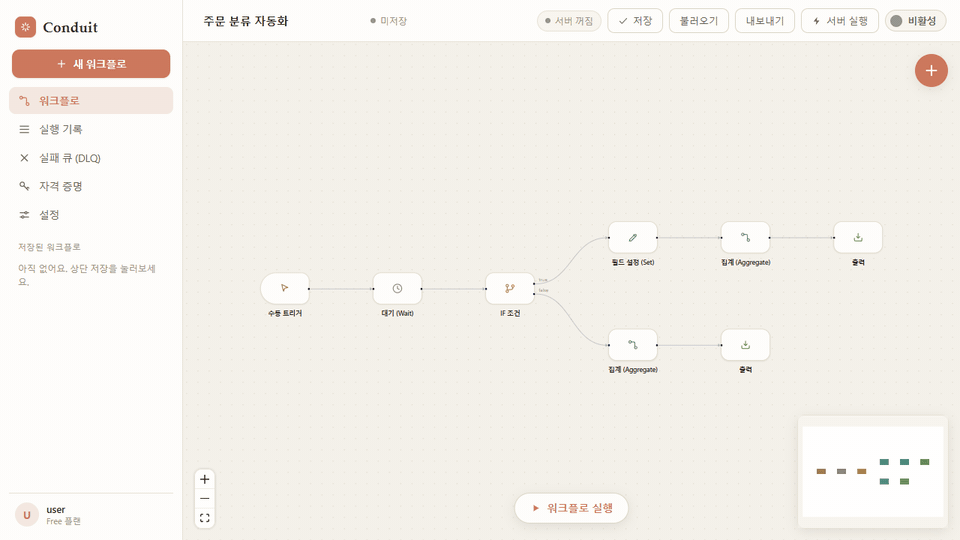

# Conduit — 자동화 워크플로 빌더

[](https://github.com/rhlfur2055-prog/conduit/actions/workflows/test.yml)



*주문 5건 → 대기(레이트 리밋 흉내) → IF `amount > 30000` → VIP 3건은 필드 설정·합계, 소액 2건은 건수 집계. 노드마다 처리한 아이템 수가 표시되고, 노드를 열면 입력·출력 아이템을 볼 수 있습니다.*

> **개발 일지는 문서 맨 아래 [📅 개발 일지](#-개발-일지) 참고.**

n8n / Make 같은 **노드 기반 자동화 툴**을 직접 만든 프로젝트입니다.
노드를 캔버스에 놓고 → 선으로 잇고 → **실행**하면 데이터가 노드 순서대로 흐릅니다.

Vite + React + [React Flow(@xyflow/react)](https://reactflow.dev) 로 만들었고,
디자인은 Claude 감성(따뜻한 크림 + 코랄)을 적용했습니다.

> 이전 이름은 FlowForge 였습니다. 브랜드명은 `src/components/Sidebar.jsx` 의 `sb-word` 한 곳에서 바꿀 수 있어요.

## Conduit으로 만든 것

### 1. 유튜브 쇼츠 자동 제작 → 실제 채널에 게시

`트리거(수동 · 매일 09:00 스케줄)` → `주제·데이터 선택` → `대본` → `TTS 내레이션` → `영상 렌더(Remotion)` → `YouTube 업로드`

Conduit 서버의 영상 모듈(`server/tts.js` · `server/render-*.js` · YouTube 업로드)로 만든 쇼츠입니다. 내레이션 생성, 화면과 낭독 싱크, 렌더, YouTube Data API(OAuth 2.0) 업로드까지 코드가 처리하고, 사람은 주제를 고르고 공개 전에 확인했습니다. 아래 영상들은 실제 채널에 공개돼 있습니다.

| [](https://youtu.be/gcmHlHI0ias) | [](https://youtu.be/LA27Sm5cgTM) | [](https://youtu.be/1lRyPFZgUqQ) | [](https://youtu.be/fbCpICUyjKk) |
|---|---|---|---|
| 회전 실루엣 착시 · 조회수 1,421 | 숨은 숫자 색각 · 조회수 1,551 | 무주의 맹시 · 조회수 1,789 | 청력 나이 · 조회수 4,093 |

*조회수는 2026-09-19 기준.*

### 2. 같은 영상을 4개 언어로 한 번에

`다국어 쇼츠` 노드 하나로 화면·정답은 그대로 두고 문구·내레이션만 한국어·영어·일본어·스페인어로 바꿔 렌더합니다. 한국어·영어 두 편을 약 2분 30초에 렌더했습니다.

### 3. Claude가 Conduit 워크플로를 직접 실행 (MCP)

Conduit 서버를 MCP 서버로 등록하면, 저장된 워크플로가 Claude의 도구(`run_<id>`)가 됩니다. "주문 처리 워크플로 돌려줘"라고 말하면 Claude가 워크플로를 실행하고 결과를 받아옵니다. 반대로 외부 MCP 서버의 도구를 Conduit 노드에서 부를 수도 있습니다. ([MCP 지원](#mcp-지원-양방향))

### 4. 실제 사이트에 붙이는 방법 — 예: 쇼핑몰 주문

맨 위 데모 GIF의 흐름에서 트리거만 `Webhook 트리거`(경로 `/new-order`)로 바꾸고 서버에 저장·활성화하면, 쇼핑몰이 주문마다 보내는 요청으로 같은 처리가 돌아갑니다.

```bash
curl -X POST http://localhost:8787/webhook/new-order \
  -H "Content-Type: application/json" \
  -d '{"customer": "김민수", "amount": 42000}'
```

웹훅 트리거는 Slack·GitHub·Stripe 방식의 HMAC 서명 검증을 지원해서, 요청이 진짜 그 서비스에서 왔는지 확인한 뒤에만 실행합니다. VIP 주문은 `Slack 메시지` 노드로 알리고, 고객 문의라면 `AI 구조화 추출` 노드로 분류해 `Notion 페이지 생성` 노드에 쌓는 식으로 확장할 수 있습니다.

### 그 밖에 만들어 둔 것 (API 키만 넣으면 동작)

- 쿠팡 파트너스·알리익스프레스·링크프라이스 상품 조회 → 광고 표기 문구 자동 삽입 → Blogger 초안 발행 — 시뮬레이션으로 전체 흐름 검증, 실제 키는 미발급

## 한눈에 보기

| | |
|---|---|
| **무엇** | n8n / Make 방식의 노드 기반 워크플로 자동화 플랫폼 (개인 프로젝트, 2026.08 ~) |
| **스택** | Vite · React · React Flow / Express · Node.js / Docker |
| **규모** | 노드 50여 종 (트리거·동작·흐름 제어·배열·연동·AI·영상·수익화·출력) · 프론트+서버 약 6,000줄 |
| **실사용** | 쇼츠 자동 제작 파이프라인(스케줄 → 대본 → TTS → Remotion 렌더 → YouTube API 업로드)으로 만든 영상 4편이 실제 채널에 공개돼 있음 — [Conduit으로 만든 것](#conduit으로-만든-것) |
| **테스트** | Vitest 141개 — 실행 엔진(실행 순서·분기·배치·병렬·재시도·오류 격리), 표현식, 재시도 정책, 노드 동작, API 인증·라우트 통합(실제 HTTP), 코드 실행 정책, MCP 패키지(stdio 엔드투엔드), 평가 실행기. `npm test` |
| **평가(evals)** | AI 노드 프롬프트를 입력 20건에 돌려 통과율·회귀 목록으로 비교. `npm run eval` — [AI 노드 평가](#ai-노드-평가-evals) |
| **MCP 패키지** | [`conduit-workflows-mcp`](packages/conduit-workflows-mcp) — Claude Desktop·Cursor 등 stdio 전용 클라이언트에서 Conduit 워크플로를 도구로 쓰는 npm 패키지 |
| **보안** | `/api`·`/mcp` API 키 인증, 키 미설정 시 로컬 전용, 외부 서버에선 코드 실행 차단(코드 노드·JS 표현식·에이전트 도구), 웹훅 HMAC 서명 검증, 크리덴셜 암호화 저장 — [API 인증](#api-인증) |

**글**: [n8n을 직접 만들며 배운 설계 결정 6가지](docs/blog/2026-09-n8n-design-decisions.md) — 아이템 배열 모델, 엔진 공용화, 재시도 분류, 실패 격리, 테스트로 찾은 버그, 코드 실행 입구 셋.

**설계에서 신경 쓴 것**

- **엔진 공용화** — `src/engine/` 실행 코어를 브라우저와 서버가 같이 씁니다. 서버 전용 기능(LLM·외부 연동·에이전트)은 `globalThis` 브리지로 주입하고, 브라우저에서는 시뮬레이션 응답으로 대체합니다. 같은 워크플로를 캔버스에서 미리 돌려 보고 서버에 올리면 그대로 동작합니다.
- **아이템 배열 데이터 모델** — n8n처럼 노드 사이를 아이템 배열이 흐르고, 일반 노드는 단일 아이템만 다루면 엔진이 반복합니다. IF/Switch/필터는 아이템 단위로 분기하고, Continue On Fail 시 실패 아이템만 DLQ로 격리됩니다.
- **MCP 양방향** — 저장된 워크플로가 MCP 도구(`run_<id>`)로 노출되어 Claude가 직접 실행할 수 있고, 반대로 외부 MCP 서버(stdio)의 도구를 노드·에이전트에서 호출합니다.
- **운영 기능** — 노드별 재시도·실패 무시·배치 크기·배치 지연, 실행 기록, DLQ UI, 크리덴셜 암호화 저장(`.enckey`), 크론 스케줄러, 웹훅 트리거.
- **외부 연동** — YouTube Data API(OAuth 2.0 리프레시 토큰, resumable 업로드), Slack, 쿠팡 파트너스(HMAC 서명), 알리익스프레스(TOP 프로토콜), 링크프라이스, Blogger, Edge TTS.

**바로 실행**: 아래 [Docker로 실행](#docker로-실행-권장--단일-컨테이너) 참고. 개발 모드는 `npm install` 후 `npm run dev`(프론트 5173) + `node server/index.js`(API 8787).

**테스트**: `npm test` — `tests/engine/` 에 엔진 단위·통합 테스트, `tests/server/` 에 API 인증 테스트. 엔진 테스트를 붙이면서 실제 버그 두 개를 찾아 고쳤습니다.
- 중복 제거 노드가 중첩 객체를 비교하지 못해 `{u:{id:1}}` 과 `{u:{id:2}}` 를 같은 아이템으로 지우던 문제 (`JSON.stringify` 배열 replacer 가 모든 깊이에 같은 키 목록을 적용하는 동작 때문)
- `"{{ a }} {{ b }}"` 처럼 표현식 두 개로만 된 문자열이 `undefined` 가 되던 문제 (단일 표현식 판별 정규식이 두 개를 하나로 잡음)

## API 인증

코드 노드는 임의 JavaScript를 실행하기 때문에, 인증 없이 외부에 열리면 누구나 서버에서 코드를 돌릴 수 있습니다. 그래서 기본값을 "전부 허용"이 아니라 **"이 컴퓨터에서 온 요청만 허용"**으로 두었습니다.

| `CONDUIT_API_KEY` | `/api/*` · `/mcp` | `/api/health` · `/webhook/*` · 화면 |
|---|---|---|
| 설정함 | `Authorization: Bearer <키>` 또는 `X-API-Key` 가 맞아야 통과, 아니면 **401** | 공개 |
| 비워 둠 | 127.0.0.1 에서 온 요청만 통과, 외부는 **403** | 공개 |

- 같은 서버의 Nginx 같은 프록시를 거친 요청은 주소가 127.0.0.1로 보이므로, `X-Forwarded-For` 가 붙은 요청은 로컬로 치지 않습니다.
- 키 비교는 SHA-256 해시 후 `crypto.timingSafeEqual` 로 해서, 응답 시간으로 키를 추측할 수 없게 했습니다.
- 웹훅은 외부 서비스가 부르는 입구라 공개하고, 노드별 HMAC 서명 검증(Slack·GitHub·Stripe 방식)으로 보호합니다.
- 화면에서는 사이드바 **설정**에 같은 키를 넣으면 됩니다 (이 브라우저에만 저장).
- 구현: `server/auth.js`, 테스트: `tests/server/auth.test.js` (실제 HTTP 요청으로 401·403·200 확인)

### 서버에서의 코드 실행 (`CONDUIT_ALLOW_CODE`)

서버에서 사용자 JS가 실행되는 입구는 코드 노드만이 아닙니다. **`{{ }}` 표현식**도 JS로 평가되고(`{{ process.env.ANTHROPIC_API_KEY }}` 한 줄로 비밀값을 읽을 수 있음), **AI 에이전트의 `run_code` 도구**는 모델이 고른 코드를 실행합니다. 하나만 막으면 나머지로 같은 일을 할 수 있어서, 스위치 하나로 셋을 함께 끕니다.

| | 코드 실행 켜짐 | 코드 실행 꺼짐 |
|---|---|---|
| 코드 노드 | 실행 | 실행하지 않고 노드 오류 |
| `{{ }}` 표현식 | JS 식 | **데이터 경로만** — `$json.a.b`, `$json["주문 번호"]`, `$items[0].x`, `$items.length`, `$index`, `$now` |
| 에이전트 `run_code` | 사용 가능 | 도구 목록에서 빠지고, 모델이 이름을 지어내 불러도 실행하지 않음 |

- 기본값: 키가 없으면(로컬 전용) **켜짐**, `CONDUIT_API_KEY` 가 있으면(외부에 연 서버) **꺼짐**. `CONDUIT_ALLOW_CODE=true|false` 로 직접 지정할 수 있습니다.
- 브라우저 캔버스에서 돌리는 실행은 내 컴퓨터 안이라 제한하지 않습니다.
- 경로 표현식은 `new Function` 없이 직접 해석하고, `constructor`·`__proto__`·프로토타입 메서드는 읽지 않습니다.
- 현재 상태는 `/api/health` 의 `code: on|off` 로 확인. 구현: `server/policy.js`, `src/engine/expr.js`(evalPath), 테스트: `tests/engine/policy.test.js`, `tests/server/policy.test.js`

## 서버 구조

처음엔 `server/index.js` 한 파일(약 500줄)에 라우트·실행·크론이 다 있었습니다. 먼저 실제 HTTP 요청으로 동작을 고정하는 통합 테스트(`tests/server/routes.test.js`)를 붙인 뒤, 동작을 바꾸지 않고 책임별로 나눴습니다.

```
server/
  index.js        진입점 — env 로드 → 브리지 주입 → 앱 생성 → listen (36줄)
  app.js          Express 조립: 미들웨어 → 공개 라우트 → 인증 게이트 → 보호 라우트 → 정적 파일
  runtime.js      execute() · Error Trigger 발동 · 크론 스케줄러
  bridges.js      LLM·연동·에이전트 등 서버 전용 기능을 공용 엔진에 globalThis 로 주입
  auth.js         API 키 인증          policy.js   코드 실행 정책
  routes/
    workflows.js  /api/workflows · /api/run · /api/executions · /api/credentials
    webhooks.js   /webhook/*  (공개 · HMAC 서명 검증 + 멱등성)
    mcp.js        /api/mcp/tools (외부 MCP 도구 목록) · /mcp (Conduit = MCP 서버)
    dlq.js        /api/dlq · /api/idempotency
    channel.js    /api/channel/stats · /dashboard
  store.js        JSON 파일 저장소 + 크리덴셜 AES-256-GCM (CONDUIT_DATA_DIR 로 위치 변경 가능)
```

- 테스트는 `CONDUIT_DATA_DIR` 을 임시 폴더로 잡아 실제 `server/data` 를 건드리지 않습니다.
- 라우터는 모두 `runtime.execute()` 를 거치므로, 실행 기록·DLQ·Error Trigger 가 웹훅·MCP·재실행 어디서 시작해도 똑같이 남습니다.

## AI 노드 평가 (evals)

LLM 노드의 프롬프트를 고쳤을 때 "더 좋아진 것 같다"가 아니라 **통과율과 회귀 목록**으로 확인합니다. 평가 파일에 노드 설정과 입력·기대값을 적어 두면, 같은 설정을 입력 전부에 돌려 리포트를 냅니다.

```bash
npm run eval -- evals/customer-inquiry.json                                    # 실제 모델 (ANTHROPIC_API_KEY 필요)
npm run eval -- evals/customer-inquiry.json --runs 3                           # 케이스마다 3번 돌려 일관성 확인
npm run eval -- evals/customer-inquiry.json --baseline evals/reports/이전.json  # 이전 리포트와 비교 → 회귀·개선 목록
npm run eval -- evals/customer-inquiry.json --dry-run                          # 키 없이 실행기·리포트만 확인 (가짜 LLM)
```

- 평가 파일 `evals/customer-inquiry.json`: 쇼핑몰 고객 문의 20건 → `aiExtract` 노드로 `category`(배송·환불·교환·상품문의·결제·기타)와 `urgent`(시급 여부)를 추출하고, 케이스마다 기대값을 검사로 적어 둡니다.
- 검사 종류: `equals` · `oneOf` · `contains` · `notContains` · `regex` · `maxChars` · `type` · `hasKeys` · `defined`. 한 검사 객체에 여러 조건을 넣으면 전부 만족해야 하고, 파일 상단 `checks` 는 모든 케이스에 공통 적용됩니다.
- 리포트는 `evals/reports/` 에 JSON 으로 남아 다음 실행의 `--baseline` 이 됩니다. 통과율만이 아니라 **어느 케이스가 새로 깨졌는지**를 이름으로 짚습니다.
- API 키가 없으면 실제 평가는 시작하지 않습니다. 시뮬레이션 응답으로 만든 0% 리포트는 의미가 없기 때문입니다.
- 구현: `server/evals.js` (노드 `run()` 을 엔진과 같은 방식으로 호출 · 검사 · 리포트 · CLI), 테스트: `tests/server/evals.test.js` (가짜 LLM 주입)

리포트 모양 — 아래는 `--dry-run` 출력입니다. 키워드 규칙으로 답을 지어내는 가짜 LLM 이라 **모델 품질과 무관**하고, 8번은 "반품… 배송비" 문장이 키워드 규칙에 걸려 틀린 것입니다.

```
평가: 고객 문의 분류 · 노드 aiExtract · 모델 claude-haiku-4-5-20251001 · 케이스 20

 1  ✔  배송 지연
 2  ✔  오늘 도착 문의(급함)
 ⋮
 8  ✖  단순 변심 반품
        - extracted.category: "배송" ≠ "환불"
 ⋮
20  ✔  행사 전 배송(급함)

통과 19/20 (95%) · 평균 0ms/케이스 · 토큰 -
기준 대비: +16 (15% → 95%)
  개선 16: 배송 지연, 사이즈 교환, 파손 환불, …
```

(마지막 두 줄은 `--baseline` 으로 이전 리포트를 넘겼을 때 붙습니다. 위 예에서는 가짜 LLM 의 키워드 매칭을 고치기 전 리포트를 기준으로 삼았습니다.)

## Docker로 실행 (권장 · 단일 컨테이너)

```bash
cp .env.example .env      # CONDUIT_API_KEY 를 채울 것 — 컨테이너 밖에서 오는 요청은 로컬이 아니다
docker compose up -d --build
```

→ http://localhost:8787 (프론트엔드 + API + 웹훅이 한 포트로 동작). 처음 열면 사이드바 **설정**에 `.env` 의 키를 입력하세요.

- 데이터(워크플로·크리덴셜·실행기록·DLQ)는 named volume `conduit-data` 에 영속화됩니다.
- ⚠️ 이 볼륨에 크리덴셜 **암호화 키(`.enckey`)**가 들어 있으니 삭제하지 마세요. 삭제 시 저장된 크리덴셜 복호화가 불가능해집니다.
- `HEALTHCHECK` 로 `/api/health` 를 감시하고, 로그는 10MB×3 로테이션됩니다.
- 컨테이너는 non-root(`node`) 유저로 실행됩니다.

## MCP 지원 (양방향)

Conduit는 **MCP(Model Context Protocol)** 를 양쪽 방향으로 지원합니다.

### 1) Conduit → MCP 서버 사용 (클라이언트)

외부 MCP 서버(stdio)의 도구를 워크플로/에이전트에서 호출합니다.

- **등록**: 자격 증명 → `MCP 서버 (stdio)` → `command`(예: `npx` 또는 `node`) + `args`
  - 예: `npx` / `-y @modelcontextprotocol/server-filesystem C:/data`
  - 데모: `node` / `C:/workflow/flowforge/examples/sample-mcp-server.mjs` (echo·add 도구 포함)
- **MCP 도구 호출 노드** (연동 카테고리): 도구 이름 비우면 목록 조회, 지정하면 호출. 인자는 JSON + 표현식 지원.
- **에이전트 도구**: `mcp_list_tools` · `mcp_call` — 에이전트가 스스로 MCP 도구를 탐색·호출.
- 프로세스는 서버 이름별 1개를 띄워 재사용하고, initialize 핸드셰이크 후 `tools/list`·`tools/call` JSON-RPC 로 통신.

검증됨: 샘플 서버 접속 → 도구 목록(echo·add) → 표현식 인자로 `add(2,3)` 호출 → `"5"` ✅

### 2) Claude → Conduit 사용 (서버)

Conduit 자체가 MCP 서버가 되어, **저장된 워크플로가 MCP 도구(`run_<id>`)로 노출**됩니다.

```bash
claude mcp add --transport http conduit http://localhost:8787/mcp
# CONDUIT_API_KEY 를 설정했다면 헤더를 함께
claude mcp add --transport http conduit http://localhost:8787/mcp --header "Authorization: Bearer <키>"
```

**stdio 로만 MCP 서버를 붙일 수 있는 클라이언트**(Claude Desktop 설정 파일, Cursor 등)에는 npm 패키지 [`conduit-workflows-mcp`](packages/conduit-workflows-mcp) 를 씁니다. Conduit 의 `/mcp` 앞에 붙는 얇은 stdio 다리이고, 도구 정의는 Conduit 한 곳에만 있습니다.

```json
{ "mcpServers": { "conduit": {
    "command": "npx", "args": ["-y", "conduit-workflows-mcp"],
    "env": { "CONDUIT_URL": "http://localhost:8787", "CONDUIT_API_KEY": "<키를 설정한 경우>" } } } }
```

```bash
claude mcp add conduit -e CONDUIT_URL=http://localhost:8787 -- npx -y conduit-workflows-mcp
```

이후 Claude Code/Desktop 에서 "conduit의 run_… 도구로 ○○ 워크플로 실행해줘"라고 하면
Claude 가 `tools/call` 로 워크플로를 실행하고 출력 노드 결과를 돌려받습니다.

검증됨: `initialize` → `tools/list`(워크플로 3개 노출) → `tools/call(input={amount:7777})` → `{"amount":7777,"ok":true}` ✅

## 아이템(배열) 데이터 모델 — n8n 식 데이터 흐름

모든 노드 사이를 흐르는 데이터는 **아이템 배열**입니다. 트리거에 배열을 넣으면 여러 아이템이 흐르고,
일반 노드는 **아이템마다 자동 반복 실행**됩니다 (노드 코드는 단일 아이템만 다루면 됨).

- **아이템별 라우팅**: IF/Switch/필터가 아이템 단위로 분기 — true 아이템은 true 경로로, false 아이템은 false 경로로 각각 흐릅니다.
- **아이템별 오류 격리**: Continue On Fail 켜면 실패한 아이템만 DLQ 격리 + `_error` 마킹하고 나머지는 계속.
- **배치 처리**: 인스펙터 **배치 처리** 섹션 — 배치 크기(N개씩 병렬) + 배치 간 지연(rate limit 대응).
- **NDV**: 입력/출력 탭에 아이템별 카드(`3 items` 카운트 + 아이템 1·2·3…)로 표시.

### 배열 카테고리 노드

| 노드 | 동작 |
|---|---|
| 배열 분해 (Split Out) | `items` 같은 중첩 배열을 아이템들로 분해, 부모 필드 병기(`include`: none/selected/all) |
| 집계 (Aggregate) | sum·avg·min·max·count·concat·toArray — N건 → 1건 |
| 정렬 (Sort) | 필드 기준 asc/desc (숫자/문자 자동판별) |
| 중복 제거 | 필드 기준 또는 전체 비교 |
| 개수 제한 (Limit) | first/last N건 |
| 병합 (Merge) | append(이어붙이기) / combine(인덱스별 필드 병합) |

검증된 파이프라인: `주문 1건 → Split Out(3 아이템) → 중복제거(2) → 코드(lineTotal 각각 계산) → 정렬 → Aggregate sum = 500` ✅

## 신뢰성 (Reliability)

n8n의 핵심 안정성 기능을 구현했습니다. 모두 동작 검증 완료.

### 재시도 + 지수 백오프
- 노드 카테고리별 기본 정책: HTTP 3회 · LLM 5회 · Email 2회 · 트리거 0회
- **일시 오류만 재시도**: 408·425·429·5xx·529·네트워크 오류 → 재시도 / **400·401·403·404·422 → 즉시 실패**
- 지수 백오프(×2) + **±20% 지터**, 카테고리별 상한(cap)
- 노드별 오버라이드: 인스펙터 **안정성** 섹션에서 재시도 횟수 지정

### Continue On Fail
- 노드별 체크박스. 켜면 실패해도 흐름이 멈추지 않고, 다음 노드로 `_error` 정보를 담아 전달합니다.

### DLQ (실패 격리 큐)
- 실패한 노드는 자동으로 DLQ에 격리: `workflow_id · node_id · payload · error_code · attempts · replay_status`
- `GET /api/dlq` 조회 · `POST /api/dlq/:id/replay` 재실행 · `DELETE /api/dlq/:id` 삭제

### 웹훅 HMAC 서명 검증
Webhook 트리거 노드에서 `signature` 선택 (`none|slack|github|stripe|generic`) + `secretCred`(크리덴셜 이름).

| 스킴 | 헤더 | 알고리즘 | 실패 응답 |
|---|---|---|---|
| slack | `X-Slack-Signature` + `X-Slack-Request-Timestamp` | HMAC-SHA256 `v0:{ts}:{body}` | 401 / 403(리플레이) |
| github | `X-Hub-Signature-256` | HMAC-SHA256(body) | 401 |
| stripe | `Stripe-Signature` | HMAC-SHA256 `{t}.{body}` | 401 / 403(리플레이) |
| generic | `X-Signature` | HMAC-SHA256(body) | 401 |

**raw body** 기준 계산, **상수시간 비교**, **±5분 리플레이 윈도우**. 시크릿은 자격 증명에 `webhook` 타입으로 암호화 저장.

### Error Trigger 워크플로 (전역 에러 핸들러)

**Error Trigger** 노드(트리거 카테고리)로 시작하는 워크플로를 만들어 **활성화**하면,
다른 워크플로가 실패할 때마다 자동 실행됩니다.

- 주입되는 에러 페이로드: `workflowName · executionId · errorNode · errorMessage · failedNodes[] · failedAt`
- 이 데이터를 표현식으로 받아 Slack/이메일 알림, Notion 장애 기록 등으로 연결하면 됩니다.
- **무한루프 방지**: 에러 핸들러 자신의 실패(trigger=error)는 재발동하지 않습니다.
- 검증됨: 실패 실행 → 핸들러 자동 발동 → `"[장애] (캔버스) 실패 — httpRequest: fetch failed"` 알림 생성 ✅

### 멱등성 (중복 실행 방지)
- 키 규칙: provider 이벤트 id 우선(`X-GitHub-Delivery`·`body.id`·`event_id`), 없으면 **body 해시** (시각은 키에 넣지 않음 — 재시도 시 키가 바뀌면 멱등성이 깨지므로)
- 상태 저장: `idempotency_key · status(pending/done/failed) · attempts · locked_until · result_ref`
- 중복 요청은 실행하지 않고 `{deduped:true, reason:"already_done"}` 반환. 처리 중이면 `in_progress`.
- 조회: `GET /api/idempotency`

## 실행 방법 (개발 모드)

이 PC는 Node.js가 **fnm**으로 설치되어 있습니다. 아래 스크립트가 환경을 잡고
**백엔드(8787) + 프론트엔드(5173)를 함께** 띄웁니다.

```powershell
powershell -ExecutionPolicy Bypass -File .\start.ps1
```

또는 수동으로:

```powershell
fnm env --shell power-shell | Out-String | Invoke-Expression
npm install     # 최초 1회
npm run dev     # http://localhost:5173
```

프로덕션 빌드: `npm run build` → `dist/`

## 핵심 기능 (n8n 코어 재현)

- **캔버스**: 팬/줌·미니맵·노드 드래그, 우상단 `+` 로 검색형 노드 추가 패널
- **연결**: 노드 오른쪽 점(출력) → 다른 노드 왼쪽 점(입력)으로 드래그
- **실행 엔진**: 위상 정렬 후 연결 순서대로 실행하며 데이터 전달
- **표현식**: 값에 `{{ $json.필드 }}` 를 쓰면 이전 노드 데이터를 참조 (`$now`, `$items`, `$index` 도 지원)
- **분기/스킵**: IF·Switch·Filter — 안 탄 경로는 자동 스킵
- **NDV 데이터 뷰**: 노드 선택 시 설정 / **입력** / **출력** 탭으로 데이터 확인
- **실행 로그 도크** + 노드별 상태 뱃지(✓·아이템 수)
- **저장**: localStorage 자동 저장 + JSON 내보내기/불러오기

## 노드 카탈로그

| 카테고리 | 노드 |
|----------|------|
| 트리거 | 수동 트리거, 스케줄 트리거\*, Webhook 트리거\* |
| AI\* | AI · Claude, AI 구조화 추출, AI 에이전트(하네스), 루프 엔지니어링 |
| 동작 | HTTP 요청, 필드 설정(Set), 코드(JS), 날짜/시간, 해시, 키 이름 변경, 대기(Wait) |
| 흐름 제어 | IF 조건, Switch(다중분기), 필터, 병합(Merge), 중단&오류 |
| 연동\* | Slack, Gmail, Notion, YouTube 검색, Naver 검색, **HTTP 요청(인증)** |
| 출력 | 출력, No-Op |

\* 표시 노드는 **백엔드 서버 + 크리덴셜**이 필요합니다. 크리덴셜이 없으면 시뮬레이션 결과를 냅니다.

### "n8n의 모든 기능"에 대하여

n8n은 400개 이상의 통합 노드 + 웹훅 수신 서버 + 크론 스케줄러 + OAuth 크리덴셜 볼트 + 실행 기록 DB를 갖춘 거대한 제품입니다.
이 중 **웹훅 수신·스케줄 실행·실제 OAuth 연동은 브라우저만으로는 불가능**하고 백엔드(Node) 서버가 필요합니다.
Conduit 은 **n8n을 n8n답게 만드는 코어 엔진**(표현식·분기·데이터 흐름·NDV)을 재현하고,
노드는 레지스트리 한 곳에 정의만 추가하면 무한히 늘릴 수 있는 구조입니다.

## 백엔드 (server/) — 실제 자동화

프론트만으로는 불가능한 것들을 Node/Express 백엔드가 담당합니다. 실행 엔진은 프론트와 **동일 소스를 재사용**합니다.

| 기능 | 엔드포인트 / 동작 |
|------|------------------|
| 서버 실행 | `POST /api/run` — 상단바 **서버 실행** 버튼이 호출 (AI 노드가 실제로 동작) |
| 워크플로 저장 | `GET/POST/DELETE /api/workflows` (파일 영속화) |
| 웹훅 수신 | `POST /webhook/<경로>` — 활성 워크플로의 Webhook 트리거로 라우팅 |
| 스케줄 | `node-cron` — 활성 워크플로의 스케줄 트리거를 크론으로 자동 실행 |
| 크리덴셜 | `GET/POST /api/credentials` — AES-256-GCM 암호화 저장 |
| 실행 기록 | `GET /api/executions` |

검증된 예: 활성 워크플로 저장 후 `POST /webhook/hook/new-order` 로 페이로드를 보내면
Webhook 트리거에 주입되어 워크플로가 실행되고 실행 기록에 남습니다.

**활성 토글**: 상단바 `활성/비활성` 토글을 누르면 즉시 서버에 저장되며 백엔드가
크론(스케줄 트리거)과 웹훅 수신을 **바로 등록/해제**합니다. (비활성 시 웹훅은 404)

## AI 노드 (n8n이 불편한 것들)

`AI` 카테고리는 **서버 실행** 시 실제 Claude를 호출합니다 (프론트 실행 시엔 시뮬레이션).

- **AI · Claude** — 프롬프트 → 응답
- **AI 구조화 추출** — 텍스트/데이터 → JSON
- **AI 에이전트 (도구 사용)** — **실제 도구를 호출하는 tool_use 루프**. LLM이 도구를 선택하면 서버가 실행하고 결과를 되먹여 목표를 수행합니다.
  - 사용 가능 도구: `run_code`(JS 실행) · `http_get`(웹 요청) · `http_auth`(인증 요청) · `youtube_search` · `naver_search` · `slack_post` · `notion_create` · `run_workflow`(저장된 다른 워크플로를 도구로 실행 — 입력 주입, 재귀 깊이 2 제한)
  - 도구별 크리덴셜 지정 가능: `도구 크리덴셜` 필드에 `slack=내슬랙, http=깃허브` 형식.
  - NDV **출력** 탭에서 각 스텝(도구·입력·결과)이 **타임라인 UI**로 시각화되고, 마지막에 최종 답변이 표시됩니다.
  - **서버 실행**은 SSE(`/api/run/stream`)로 노드 상태·로그·에이전트 스텝을 **실시간 스트리밍** — 타임라인이 도구 호출마다 라이브로 채워집니다.
- **루프 엔지니어링** — 기준을 두고 N회 반복 개선

프롬프트에 `{{ $json.필드 }}` 표현식을 그대로 쓸 수 있어요.

### 실제 Claude 호출 켜기

둘 중 하나면 됩니다:

```powershell
# 1) 환경변수
$env:ANTHROPIC_API_KEY = 'sk-ant-...'
# 그 후 server 를 재시작

# 2) 크리덴셜로 저장 (type=anthropic)
# POST /api/credentials  { "name":"Claude", "type":"anthropic", "data": { "apiKey":"sk-ant-..." } }
```

키가 없으면 AI 노드는 시뮬레이션 응답을 내므로 워크플로는 항상 "동작"합니다.
기본 모델: `claude-sonnet-5` (옵션: `claude-opus-5`, `claude-haiku-4-5-20251001`).

## 실연동 노드 (실제 API 호출)

`연동` 카테고리는 **서버 실행** 시 저장된 크리덴셜로 실제 API를 호출합니다.

| 노드 | 필요한 크리덴셜 |
|------|----------------|
| Slack 메시지 | `slack` — Bot Token (`xoxb-…`) |
| Gmail 보내기 | `gmail` — Gmail 주소 + 앱 비밀번호(SMTP) |
| Notion 페이지 생성 | `notion` — Integration Token |
| YouTube 검색 | `youtube` — Data API Key |
| Naver 검색 | `naver` — Client ID + Secret |
| **HTTP 요청(인증)** | `httpAuth` — Bearer / API 키 헤더 / Basic |

### "어떤 API든 연결" — 범용 HTTP 노드

**HTTP 요청(인증)** 노드는 Bearer 토큰·API 키 헤더·Basic 인증을 지원해
GitHub·Stripe·OpenAI·Discord·Airtable·SendGrid 등 **대부분의 REST API**를 노드 하나로 호출합니다.
(OAuth 전용 API는 별도 토큰 발급이 필요합니다.)

### 크리덴셜 추가

사이드바 **자격 증명** → 종류 선택 → 값 입력 → 저장.
값은 서버에서 **AES-256-GCM** 으로 암호화되어 저장되고, 목록/응답에는 노출되지 않습니다.

## 새 노드 추가하는 법

`src/engine/nodeTypes.js` 의 `NODE_TYPES` 에 항목 하나만 추가하면 팔레트에 자동 등록됩니다:

```js
myNode: {
  title: '내 노드', icon: 'edit', color: '#22c55e', category: '동작',
  inputs: ['main'], outputs: ['main'],
  defaults: { greeting: '안녕 {{ $json.name }}' },
  fields: [{ key: 'greeting', label: '인사말', type: 'text' }],
  summary: (p) => p.greeting,
  run: async (inputs, params) => ({ main: { ...inputs.main, msg: params.greeting } }),
},
```

`run` 이 받는 `params` 는 실행 엔진이 표현식을 이미 해석해서 넘겨줍니다.

## 구조

```
src/
├─ engine/
│  ├─ nodeTypes.js   # 노드 정의(메타 + 필드 + run) — UI 독립, 프론트/백엔드 공용
│  ├─ executor.js    # 위상정렬 실행 + seed 주입 + 입/출력 캡처
│  └─ expr.js        # {{ }} 표현식 해석
├─ ui/icons.jsx      # 라인 SVG 아이콘
├─ components/       # FlowNode · Sidebar · NodePanel · Inspector(NDV) · LogPanel
├─ api.js           # 백엔드 API 클라이언트
├─ flowActions.js    # 노드 액션 컨텍스트
└─ App.jsx           # 앱 셸 + 상태/저장/로컬·서버 실행

server/               # Node/Express 백엔드
├─ index.js          # 라우트 + 웹훅 + 크론
├─ store.js          # 파일 영속화 + 크리덴셜 AES 암호화
└─ llm.js            # Anthropic 호출 브리지
```

---

## 📅 개발 일지

### 2026-08-02 — 프로젝트 시작 & 완성 (1일차)

하루 만에 0 → 풀스택 자동화 플랫폼까지. 작업 순서대로:

**오전~오후: 기반 구축**

1. **환경**: Node.js v24 설치(fnm), Vite + React + React Flow 스캐폴딩
2. **에디터**: 캔버스(팬/줌/미니맵), 노드 연결, 검색형 노드 추가 패널, 인스펙터, 실행 로그
3. **디자인**: Claude 감성(크림 #f4f1ea + 코랄 #cc785c), 라인 SVG 아이콘, SaaS 셸(사이드바/상단바). 이름 FlowForge → **Conduit**
4. **실행 엔진**: 위상정렬 실행 + `{{ $json.필드 }}` 표현식 + NDV(입/출력 데이터 뷰)

**오후: 백엔드 & AI**

5. **Express 백엔드**: 서버 실행 API, 워크플로 CRUD, 웹훅 수신, node-cron 스케줄러, AES-256-GCM 크리덴셜, 실행 기록
6. **AI 노드 4종**: AI·Claude / 구조화 추출 / **에이전트(tool_use 루프)** / 루프 엔지니어링
7. **실연동**: Slack·Gmail(SMTP)·Notion·YouTube·Naver + **범용 인증 HTTP**(Bearer/API키/Basic)
8. **에이전트 고도화**: 실도구 8종 + 도구별 크리덴셜 주입 + **타임라인 UI** + **SSE 실시간 스트리밍** + **서브워크플로 도구(run_workflow)**
9. **SaaS 화면**: 크리덴셜 매니저, 실행 기록 화면, 다중 워크플로 저장/전환, 활성 토글→크론/웹훅 즉시 등록

**저녁: 신뢰성 & 아키텍처**

10. **신뢰성 전체 스펙 구현**: 재시도(지수백오프+지터, 일시/영구 오류 구분) · Continue On Fail · DLQ(+replay) · 웹훅 HMAC 서명검증 4종(slack/github/stripe/generic, 상수시간 비교+리플레이 윈도우) · 멱등성(중복 실행 차단) · **Error Trigger 전역 에러 핸들러**
11. **아이템 배열 데이터 모델**(n8n식): 아이템별 자동 반복 실행·아이템별 IF 라우팅·아이템별 오류 격리·배치 병렬+지연. 배열 노드 6종(SplitOut/Aggregate/Sort/중복제거/Limit/Merge)
12. **Docker**: 멀티스테이지 Dockerfile + compose(볼륨/헬스체크/non-root). 단일 포트(8787) 프로덕션 서빙 검증
13. **MCP 양방향**: ① 클라이언트 — stdio MCP 서버 접속(mcpTool 노드 + 에이전트 mcp_call), ② 서버 — `/mcp` 엔드포인트로 워크플로를 Claude의 도구로 노출

**최종 상태**: 노드 40여 종 · 8개 카테고리, 모든 기능 엔드투엔드 검증 완료.

**내일 후보**
- [ ] `claude mcp add` 로 Conduit 등록해 Claude가 워크플로 실행하는 것 실제 시연
- [ ] MCP 도구 자동 노드화 (연결된 서버의 도구가 노드 패널에 자동 표시)
- [ ] DLQ 화면 (UI에서 실패 항목 조회·재실행)
- [ ] 캔버스 라이브 아이템 카운터
- [ ] Docker Desktop 설치 후 실제 컨테이너 기동 테스트

**재시작 방법**
```powershell
powershell -ExecutionPolicy Bypass -File C:\workflow\flowforge\start.ps1
```
(백엔드 8787 + 프론트 5173 함께 기동. node는 fnm으로 설치되어 있어 스크립트가 환경을 잡아줌)

### 2026-08-03 — 2일차: 운영 편의 기능

1. **DLQ 화면** — 사이드바 "실패 큐 (DLQ)" 메뉴 → 실패 항목 목록(노드·워크플로·시각·상태) + 격리 페이로드 미리보기 + **↻ 재실행** / 삭제. (재실행은 저장된 워크플로만 가능)
2. **MCP 도구 자동 노드화** — `GET /api/mcp/tools` 로 등록된 MCP 서버들의 도구를 수집, 노드 추가 패널에 **"MCP · <서버명>"** 그룹으로 자동 표시. 클릭하면 크리덴셜·도구명이 프리셋된 MCP 노드가 추가됨. 검색도 됨.
3. **캔버스 라이브 아이템 카운터** — 아이템을 여러 개 처리하는 노드는 실행 중 노드 아래에 **`1/4 → 2/4 → 3/4`** 진행이 실시간 표시(SSE `progress` 이벤트). 완료되면 "4 items"로 전환.
   - 검증: 4아이템×500ms 대기 워크플로 실행 중 라이브 값 `1/4 → 2/4 → 3/4` 포착 ✅

**남은 후보**: `claude mcp add` 실등록 시연 · Docker Desktop 설치 후 컨테이너 기동 테스트

### 2026-08-09 — 3일차: 영상 자동화 (쇼츠 공장)

1. **`Workflows.save` 부분 업데이트 수정** — 넘긴 필드만 갱신, 생략 필드는 기존 값 유지 (노드 유실 버그 해결)
2. **.env 체계** — 프로젝트 루트 `.env` 를 백엔드가 자동 로드(`process.loadEnvFile`). 크리덴셜 저장소가 비면 .env 값으로 폴백. YouTube OAuth 리프레시 토큰 발급 가이드 주석 포함.
3. **로컬 영상 렌더 파이프라인** (`C:\workflow\video-pipeline`) — Remotion + ffmpeg. **n8n은 외부 유료 API(Creatomate 등)가 필요한 렌더링을 로컬 무료로 해결.**
   - `DataShort` 컴포지션: 훅(3s) → 랭킹 가로바(순차 공개+카운트업, 1위 금색) → CTA. 한글 NotoSansKR. 데이터 개수로 길이 자동 계산.
   - 템플릿들의 `loadFont` 시그니처 버그 수정 (`loadFont('normal', {weights, subsets})`)
4. **영상 카테고리 노드 2종**:
   - **쇼츠 렌더 (랭킹)** — 제목·데이터(표현식)를 받아 실제 MP4 렌더 (`npx remotion render` → ffmpeg CRF23 faststart → 썸네일 → ffprobe 검증)
   - **YouTube 업로드** — OAuth 리프레시 토큰으로 실제 resumable 업로드 (.env 크리덴셜 없으면 시뮬)
5. **수익화 워크플로 "쇼츠 공장 — 연봉 실수령액"** 저장·실행: 트리거(데이터) → 쇼츠 렌더 → YouTube 업로드 → 출력.
   - **검증: 17.6초 만에 1080×1920 H.264 17.5초 MP4 + 썸네일 실제 생산** ✅ (업로드는 크리덴셜 대기)

**수익화 메모**: 무키(TTS 없이) 가동 가능한 니치 = 데이터 랭킹 쇼츠(faceless). 첫 주제 "연봉별 월 실수령액"(금융 니치·높은 CPM·에버그린). .env에 TTS/YouTube 키만 채우면 내레이션+자동 업로드까지 완전 자동화.

**남은 후보**: .env 키 채우고 실제 업로드 시연 · 스케줄 트리거로 매일 자동 생산 · TTS 내레이션 붙이기

### 2026-08-09 (오후) — 무료 TTS 내레이션

1. **TTS 내레이션 (무료) 노드** — API 키 완전 불필요:
   - 1순위 **Edge TTS** (`msedge-tts`): MS Edge 신경망 한국어 음성 3종(선희·인준·현수) — 유료급 품질, 인터넷만 필요
   - 2순위 **Windows SAPI**(Heami): 완전 오프라인 폴백
   - 같은 대본+음성은 해시 캐시 재사용. 출력: `server/data/tts/*.mp3`
2. **쇼츠 렌더에 내레이션 합성** — `audioPath` 파라미터 → DataShort `<Audio>` 마운트, 내레이션이 길면 CTA 구간이 자동 흡수(Root calculateMetadata가 오디오 길이 반영). ffmpeg `loudnorm I=-14`로 라우드니스 정규화.
3. **안정성** — spawn `error` 리스너 전면 추가 + 서버 전역 uncaught/unhandled 가드(장시간 자동화 서버 크래시 방지). msedge-tts는 출력 폴더를 미리 만들어야 함(mkdirSync).
4. **검증**: 대본 → TTS(11~21초, edge:ko-KR-SunHiNeural) → 렌더 21초 → MP4에 aac 오디오 스트림 + mean_volume −18.2dB(실제 소리) ✅

**오픈소스 스택 정리 (전부 무료)**: Remotion(렌더) · ffmpeg(후처리) · Edge TTS(내레이션) · Whisper 자막만 유일하게 키 필요(OPENAI) — 자막 없이도 화면 텍스트로 충분.

### 2026-08-09 (저녁) — 데일리 자동 생산 가동

**"데일리 쇼츠 공장 (매일 09:00)" 워크플로 활성화** — 완전 자동 생산 라인:

```
스케줄(매일 09:00) → 주제 로테이션(코드: 날짜 % 4) → 무료 TTS → 쇼츠 렌더 → YouTube 업로드 → 출력
```

- **주제 큐 4종** (검증된 금융 랭킹, 순환): 연봉 실수령액 · 국가별 1인당 GDP · 국가별 최저시급 · 대기업 평균 연봉. 주제 추가는 코드 노드의 TOPICS 배열에 항목만 추가.
- **크론 발동 실증**: 매분 테스트 워크플로가 70초 내 자동 발동(`trigger:schedule` 기록) ✅
- **수동 검증**: 오늘의 주제(topicIndex 2 = 최저시급) 자동 선택 → 내레이션 쇼츠 18.5초 만에 생산 ✅
- 업로드는 .env의 YouTube OAuth 3종을 채우는 순간 실업로드로 전환 (기본 private).
- ⚠️ 매일 09:00 발동하려면 **백엔드가 켜져 있어야 함** (`start.ps1` 또는 추후 Docker 상시 가동).

### 2026-08-09 (밤) — RankRace v2 + 글로벌 이중언어 공장

리서치(검증 채널 8곳·포맷 7종·엔진 10종 비교) 기반으로 전략 확정: **"한국은 몇 위?" 국가비교 랭킹 + 이중언어 채널** (표본: WawamuStats·MetaBallStudios 다국어 전략·이과형 반전 훅).

1. **RankRace v2 컴포지션** — 검증 포맷의 생동감 6종 전부 구현:
   순위 추월 레이스(꼴찌부터 공개, 새 1위가 위로 밀고 들어옴) · 국기 팝인(flagcdn PNG 자동 캐시) · 숫자 카운트업 · **틱/우시 효과음** · **1위 직전 드럼롤 정지("1위는...?")** · 줌 펀치인+쉐이크 · 한국 행 금색 하이라이트.
2. **효과음 4종을 ffmpeg로 합성** (tick/whoosh/drumroll/impact) — 에셋 다운로드 없이 무료·오프라인 (`public/sfx/`).
3. **영어 TTS 추가** — Edge 신경망 Jenny/Christopher (무료). tts 노드 음성 선택지 확장.
4. **데일리 공장 v2** (`wf_8537b162` 교체, 12노드): 스케줄 → 주제 로테이션(6종) → **[한국판: 선희 TTS → 렌더 → 업로드] + [영어판: Christopher TTS → 렌더 → 업로드]** 병렬 2편.
   - 주제 큐 6종(국가비교): 최저시급 · 연간 근로시간 · 인터넷 속도 · 빅맥 가격 · 출산율 · 커피 소비량 — 전부 한국 랭크인 + 글로벌 소재.
5. **검증**: 55초 만에 한국판(23.4s)+영어판(22.5s) 동시 생산, 각각 aac 내레이션 실측(-18dB) ✅. 업로드는 .env OAuth 대기.

**전략 근거(리서치)**: 국기+수치 포맷은 언어 장벽 없음(RED SIDE 나레이션 없이 2천만 뷰) · 미국/유럽 시청자 RPM이 한국의 2~3배 · MetaBallStudios가 같은 영상 다국어 재활용으로 한국어판 28만·일본어판 40만 구독 증명.

### 2026-08-09 (심야) — 실데이터 순위 + 조회수 검증 기반 v3 재설계

1. **실데이터 랭킹 노드** (`rankData`, server/rankdata.js) — World Bank Open Data API(무료·무키)로 전 국가 실측값 수집 → **실제 세계 순위** 계산 → 상위 3 + **미·중·일·한 필수 포함** 선별. 지표 6종(출산율·1인당GDP·기대수명·인구·인터넷이용률·실업률), 6시간 캐시, 한글 국가명 매핑.
   - 검증: 출산율(217개국) 한국 216위 0.75명 / GDP(186개국) 한국 32위가 일본 33위 추월 — 실데이터가 가짜 "7위"보다 강한 훅을 만듦.
2. **조회수 잠재력 3각 비판 검증** (리텐션·경쟁·패키징 에이전트, 웹서치 기반): 전원 3/10 판정. 치명 결함 — ①0~2.5초 정적 타이틀=스와이프 즉사 ②드럼롤이 "1위"에 걸려 시청자 궁금증("한국 몇 위?")과 페이오프 불일치+조기 유출 ③엔딩 3.5초 정적 CTA=26% 데드타임 ④BGM 부재 ⑤한/영 동일 채널 금지 ⑥제목 #shorts·과장 금지.
3. **RankRace v3 재설계** (치명 3건 반영): 0.2초 즉시 레이스 시작(제목은 상시 헤더) · **한국 봉인**(맨 마지막 공개, 드럼롤 문구 "대한민국은...?", 임팩트+글로우) · CTA를 랭킹 위 하단 배너 오버레이로(데드타임 0) · 가속→감속 템포(26→32→40f) · 실순위 뱃지(133·203·210…) · BGM 훅 지원(public/bgm에 루프 넣으면 자동 믹스+드럼롤 컷아웃).
4. **데일리 공장 v3** (13노드): pick → rankData(라이브 주제만 fetch) → 한/영 prep(실데이터로 대본 자동 생성) → TTS → 렌더 → 업로드. 주제 6종 = 실데이터 2(출산율·GDP) + 큐레이션 4(미·중·일 포함, "주요국 비교" 정직 라벨). 제목에서 #shorts 제거.
   - E2E 검증: 58초에 2편, 내레이션에 실순위 자동 반영("217개국 중 216위") ✅

**남은 개선 큐(검증 처방)**: 로열티프리 BGM 루프 확보(public/bgm) · 한/영 채널 분리 운영 · 배경 모션 레이어 · TTS 지문 희석(보이스 로테이션) · '대량생산' 정책 리스크 관리(템플릿 변형).

### 2026-08-09 (심야 2) — 5인 패널 검증 → 반전판 + 주제 발굴 TOP4

1. **BGM 자동 믹스** — ffmpeg로 펄스 비트 합성(킥+햇+드론, 에셋 0개), `public/bgm/*.mp3` 자동 선곡, 드럼롤 구간 컷아웃.
2. **한국 시장 5인 패널 검증** (시청자·리텐션·알고리즘·크리에이터·수익화, 웹서치 기반): 출산율 원판 **평균 5.8/10, 전원 "조건부"**. 전원 일치 진단: "한국 꼴찌"는 전 국민이 아는 답이라 드럼롤이 헛돔. **전원 일치 발견: 진짜 떡밥은 216/217 = "꼴찌가 아니다"**.
3. **반전판(플립) 구현**: 훅 "출산율 꼴찌, 한국이 아닙니다" → 한국 216위 먼저 공개 → **북한 120위(96계단 위, 실데이터)** → 드럼롤 "진짜 꼴찌는...?" → **마카오 0.58명 리빌**. `finale` 필드(봉인 대상 분리), 꼬리 절단(리빌+2초 내 종료, CTA 즉시 오버레이), rankData `bottom` 파라미터(최하위 N). 대본은 실데이터에서 자동 생성.
4. **주제 발굴 3방향+심사 워크플로** (모든 증거 2026-08-09 유튜브 직접 확인): TOP4 =
   ① **시니어 두뇌퀴즈**(치매예방 초성/숨은단어 — '치매야 잘가라' 히트 469만회, 후발주자 성장 확인, 100% Remotion 텍스트, 시니어 광고단가)
   ② **돈 데이터 쇼츠**(실수령액 242만·아파트 414만회 검증, 국토부/국세청 공공 API로 소재 무한, 최고 RPM, Guess-the-Price 퀴즈 오프닝 합병)
   ③ 이모지 눈 테스트(100% 절차 생성·언어 중립) ④ 암산 트랩(댓글 논쟁 최강)
   — 기각: 밸런스게임(한국 faceless는 무덤), 운세(상한 낮음), 넌센스 IQ(포화).

### 2026-08-09 (심야 3) — 시니어 두뇌퀴즈 가동 + 3D 착시 기술검증 + 리서치 3종

1. **BrainQuiz 컴포지션** (시니어 라이트 테마: 크림 배경·초대형 글자·고대비) — 문제 3유형: 다른글자 찾기(oddone)·숨은단어(hidden)·초성(chosung). 문제당 카운트다운 게이지+틱, 정답 딩동+하이라이트, 자가채점 엔딩. 마림바 BGM(ffmpeg 합성, bgm-quiz/). 내레이션 길면 엔딩이 흡수(빈 꼬리 방지). `brainQuiz` 노드 + "시니어 두뇌퀴즈 공장" 워크플로(wf_6466cd33). 샘플: 해외 검증 소재 수입(Lustre Quiz 다른글자·BrainLift 숨은단어) + 인준 TTS, 43초 렌더 검증 ✅
2. **회전 실루엣(좌뇌우뇌 1,018만회 포맷) 기술검증 완료**: @remotion/three@4.0.460 설치됨·프레임 결정론 확인·CC-BY GLB 모델 URL 4종 HTTP 200 검증·실루엣 원리(unlit 검정 머티리얼=깊이 단서 제거). 원본 GIF 대신 자체 3D 렌더로 저작권 청정. 구현 코드 패턴 확보 — 다음 컴포지션 후보.
3. **착시/테스트 카탈로그 8종** (조회수 증거 확인): ADHD 집중력 1,544만 · 착시 1,324만 · 색각 도트 929만 · 좌뇌우뇌 1,018만 · 색 잔상 189만 등 — 전부 코드 절차 생성 가능(저작권 리스크 제로 경로 문서화). '진단' 표현 금지 규칙.
4. **힐링 재포장 연구**: 채널명 후보(쉼표한스푼·포근연구소 등, 충돌 검색 완료), 파스텔 비주얼·나긋 TTS·"못 찾아도 괜찮아요" CTA 문법. 정직 판정: 순수 조회수엔 다소 불리, 유형진단형엔 유리 — "훅 구조는 유지, 말투 스킨만 교체" 권고.
5. **운동 니치 리서치**: "치킨 한 마리 = 러닝 몇 분?" 칼로리 환산 포맷 — 구독 4천–8천 신규급 채널들이 30만–130만 히트(하페테리아 59만·꾹제나 130만 직접 확인) = 채널 파워가 아니라 소재가 터지는 영역. 42초 완전 스펙 + 소재 10개 확보(미구현).

### 2026-08-09 (심야 4) — 두뇌퀴즈 오디오 1:1 싱크

**문제**: 내레이션이 한 덩어리라 화면 진행과 어긋남 (문제 낭독 중 카운트다운 시작, "정답은..." 멘트와 리빌 타이밍 불일치).
**해결**: 문장별 TTS 세그먼트 아키텍처 —
1. `renderBrainQuiz`가 서버에서 **문장별 TTS 생성**(인트로/문제N/정답N/엔딩, `globalThis.__conduitTtsSpeak` 브리지, 캐시 재사용) → ffprobe로 각 mp3 **실측**
2. `buildTimeline()`: 실측 프레임 수가 화면 타임라인을 결정 — 문제 낭독이 끝나야 카운트다운 시작, 리빌 프레임 = 정답 낭독 시작 프레임
3. 컴포지션은 각 세그먼트를 정확한 프레임에 `<Sequence><Audio>` 마운트, 틱/딩동도 마크 기준 배치
4. 라운드별 길이가 가변이므로 `quizTotalFrames(n, cd, segments)`로 메타데이터 계산
5. 노드 인터페이스 단순화: tts 노드 불필요 — brainQuiz 노드에 voice만 지정 (워크플로 3노드로 축소)

**검증(실측)**: 카운트다운 끝자락 -34dB(틱만) → 리빌 순간 -16.5dB(정답 낭독) + 같은 프레임에 하이라이트/정답 라벨 ✅. 규칙: qText/aText로 문장 커스텀 가능, 낭독이 길어지면 화면이 자동으로 밀림(추정 없음, 구조적 동기화).

### 2026-08-09 (심야 5) — 회전 실루엣 착시 테스트 완성 + 업로드 준비

1. **.env 점검**: 전 키 비어있음 확인 — YouTube 업로드는 CLIENT_ID/SECRET/REFRESH_TOKEN 3종만 채우면 활성화. out/ 테스트 영상 34개(26MB) 전체 삭제.
2. **SpinTest 컴포지션** (1,018만회 좌뇌우뇌 포맷 재현): @remotion/three + fiber@9/drei@10(React 19), CC-BY 고양이 GLB(poly.pizza), 무광 검정 머티리얼(깊이 단서 제거=양방향 착시), fov 24, 조명·그림자 없음. 섹션별 내레이션 1:1 싱크(BrainQuiz 세그먼트 구조 재사용), 하단 밴드 색상 에스컬레이션(빨강 우뇌→파랑 좌뇌→금색 14%), 총 길이를 회전 주기 배수로 올림 → 무한루프 이음새 없음.
3. **핵심 트러블슈팅 (중요)**: GLB 로드를 ThreeCanvas "안쪽" 컴포넌트에서 하면 delayRender가 추적되지 않아 모델이 안 보임 — 반드시 캔버스 바깥에서 로드 후 group을 내려보낼 것. 바운딩박스 자동 스케일로 모델 크기 무관하게 화면 맞춤. 렌더는 --gl=angle.
4. **spinTest 노드** + "착시 테스트 공장"(wf_f510cdf4): 트리거 → 렌더(TTS 내장) → YouTube 업로드(제목·설명·CC-BY 표기 자동, private) → 출력. **39.5초 만에 36.1초 완성 영상** ✅. 업로드는 OAuth 대기 상태로 스테이징 완료.

### 2026-08-09 (심야 6) — YouTube OAuth 실발급 완료 (Claude in Chrome)

1. 크롬 로그인 세션으로 GCP 콘솔 직접 조작: 프로젝트 `conduit-youtube` 생성 → YouTube Data API v3 활성화 → Google 인증 플랫폼 "Conduit Uploader"(외부/테스트 모드) → 테스트 사용자 등록 → 데스크톱 클라이언트 `conduit-desktop` 발급.
2. 루프백 플로우(localhost:8791 수신기)로 동의 → 리프레시 토큰 자동 교환·기록. **.env의 YOUTUBE_CLIENT_ID/SECRET/REFRESH_TOKEN 전부 채워짐** (scope: youtube + youtube.upload). 백엔드 재시작으로 로드 확인.
3. 이제 youtubeUpload 노드가 시뮬 모드가 아닌 **실업로드 모드**. 실행: `curl -X POST http://localhost:8787/api/workflows/wf_f510cdf4/run` (비공개 업로드로 스테이징돼 있음).
4. 참고: 계정 채널 확인 결과 "그리"(@code-maste, 구독 142). 콘텐츠 니치 = 한국 소개(Korean Commute Vibe 7.5천). 착시/퀴즈 쇼츠와 병행 가능.

### 2026-08-09 (심야 7) — 첫 공개 업로드 + 채널 리브랜딩

1. **첫 완전 자동 업로드**: wf_f510cdf4 실행 → 렌더 36.1초 영상 → 실업로드 성공 https://youtu.be/gcmHlHI0ias
2. 3-agent 카피 패널(알고리즘 관점 + 브랜딩 관점 + 편집장 합성) → 제목 "단 14%만 둘 다 보인다는 고양이 착시ㅣ당신은 좌뇌? 우뇌?", 설명 첫줄 훅+댓글CTA+해시태그 5개+CC-BY 유지, 태그 14종.
3. videos.update로 메타 교체 + **공개 전환**(미인증 API 프로젝트인데도 비공개 잠금 없이 정상 공개됨 — 확인됨), channels.update(brandingSettings)로 채널 설명/키워드/국가(KR) 교체. 스크립트: scratchpad/apply-youtube-meta.mjs (재사용 가능 패턴).
4. 채널 정체성 확정: "그리 — 매일 하나, 30초 두뇌 테스트 채널" (착시/두뇌퀴즈/데이터랭킹 3축 + 한국 일상 서브).

### 2026-08-09 (심야 8) — 두뇌퀴즈 v2 팝 테마 전면 재시공 + 퀄리티 리서치

1. 사용자 판정 "재미없다" 수용 → BrainQuiz.tsx 비주얼 전면 교체(싱크 엔진은 유지): 라운드별 원색 배경 로테이션(보라/블루/레드/그린), 왕타일 4×3(기존 115px→236px), 도넛 SVG 타이머(마지막 2초 빨강 비네트+박동), 정답 화이트 플래시+골드 타일+파티클 14개, whoosh/impact SFX 추가, 엔딩=등급 판정표(3개=상위5% ~ 0개) + "내일 아침 9시" 시리즈 예고. 카운트다운 5→3초.
2. ⚠️ Sequence 내부 컴포넌트는 useCurrentFrame()이 상대 프레임 — GradeEnding에서 frame-endingStart 이중 차감 버그 잡음.
3. 9-에이전트 리서치(4트랙+링크검증+합성) 완료: 퀄리티 TOP5(0프레임 훅/단어팝 자막(edge-tts WordBoundary)/카운트다운 링+봉인 규칙/1.5~3초 비트 그리드/심리스 루프=조회수 가산) + 검증된 심화 포맷 TOP5(집중력 반전 3,372만·색각 절차생성 2,684만+한국929만·청력나이 2,470만·판정 래퍼 630만·스트룹 373만/0.5일). Quaternius CC0 동물 12종 = SpinTest 시리즈 소재 검증됨. 상세: tasks/ws53ft5hc.output

### 2026-08-09 (심야 9) — 정직화 정책 + 5개 포맷 병렬 구축

1. **no-fake-stats 정책** (사용자 지시): 근거 없는 수치 훅("상위 1%", "14%만", "99%가") 전면 금지. 논문/공식 통계 있는 주장만 허용 + 출처 링크 필수. 질문형/도전형 훅으로 대체. 메모리 no-fake-stats.md 등재.
2. 소급 적용: 라이브 고양이 영상 제목·설명 교체(Troje & McAdam 2010 논문 링크 첨부, 좌뇌우뇌=속설 고지), 착시 공장 wf_f510cdf4 대본 재작성, BrainQuiz 등급표·v4 생성기 카피 정리, 신규 5종에서 가짜 수치 13곳 제거.
3. **BrainQuiz 난이도 사다리**: 자모 수학(평음/경음=중급, ㅐ↔ㅔ=최상급) 페어 무한 생성 + 라운드별 제한시간(cd)/난이도 별점(stars) 지원. buildTimeline이 라운드 배열 받도록 확장.
4. **5개 포맷 병렬 구축 완료** (6-agent 워크플로, tsc 통과): Stroop(3라운드 가속) / HearingAge(8k~17kHz 톤 7단계, loudnorm 제외 규칙) / MindAge(점수 합산 판정) / ColorVision(이시하라식 절차 생성 — 5x7 비트맵 폰트 판정, 시드 PRNG 도트) / AttentionTest(결정적 물리 공 튕기기 + 고양이 몰래 등장, Simons&Chabris 1999 컨셉). 각각 src/*.tsx + server/render-*.js, Root 등록 완료.

### 2026-08-09 (심야 10) — 주간 편성 예약 업로드 + 검증 댓글 시스템 완성

1. force-ssl 재동의(루프백) → 댓글 API 활성화. 라이브 고양이 영상에 논문 검증 댓글 게시 성공(Troje & McAdam 2010).
2. **4편 예약 업로드** (publishAt, 매일 09:00 KST): 월=색각(LA27Sm5cgTM) 화=집중력(1lRyPFZgUqQ) 수=청력(fbCpICUyjKk) 목=정신연령(850ScUCEt2w). 설명란에 출처 + "재미용" 고지.
3. **검증 댓글 봇** (wf_dc1b041e, active, 매분): 예약 영상이 공개되면 3분 내 논문/출처 댓글 자동 게시. 멱등(기존 📚 댓글 확인 후 스킵), 26시간 재시도 창. ⚠️비공개/예약 영상엔 댓글 불가라 공개 후 게시가 정답.
4. ⚠️엔진 교훈: 코드 노드는 new Function(동기)이라 top-level await 불가 — `return (async () => {...})()` 패턴 필수.

### 2026-08-10 (자정) — 채널 관제실 + 조회수 극대화 리서치 2탄

1. **채널 관제실** (server/dashboard.html + /api/channel/stats + /dashboard 라우트): 바탕화면 "그리 채널 관제실" 아이콘 → 이번주 편성(실시간 조회·좋아요·댓글, 스튜디오 링크) + 워크플로 유지보수(클릭 실행, confirm 가드) + 서버 상태. 30초 자동 갱신. /dashboard는 SPA 폴백보다 먼저 등록해야 함. v3 데일리 공장은 비활성화(기각된 출산율 방지).
2. **리서치 2탄** (9-agent, 링크검증): 핵심 — ①2025-03-31부터 raw 조회수는 허수(재생 즉시 1뷰) → engagedViews·APV·VVSA로 판정 ②⚠️2025-07-15 비진정성 정책: "시드만 바꾼 변형 대량업로드"가 수익화 금지 명시 타깃 → 재등판시 훅·테마·난이도 실질 교체+변경로그 필수 ③길이 15~25초 최적(11-20초 중앙값 901회) ④제목: 질문형 배제, 결과예고/손실/도전형 A/B, 25자 프론트로드 ⑤릴스 = Graph API 개발모드로 무료 완전자동(클린 마스터 별도 렌더 필수 — 워터마크 재업로드 공식 페널티), 틱톡 SELF_ONLY 대기, 클립 수동+크리에이터 지원. 업로드 시간대 최적화는 공식 부정. 전체 플랜: scratchpad/growth-plan.json

### 2026-09-19 — 공개 전환 · 테스트 · 보안 · 구조 · 패키지

1. **공개 저장소** — 비밀값(`.env`·`server/data`·`.enckey`)이 빠졌는지 두 번 확인한 뒤 GitHub 공개. README 상단에 개요·데모 GIF(주문 5건 분기)·CI 배지.
2. **테스트 0 → 150** — 엔진(실행 순서·분기·배치·병렬·재시도·오류 격리)·표현식·재시도 정책·노드 동작 69개로 시작. 붙이면서 **버그 2건**: `stableKey`가 중첩 객체 키를 버려 중복 제거가 `{u:{id:1}}`과 `{u:{id:2}}`를 같은 아이템으로 지움(`JSON.stringify` 배열 replacer가 모든 깊이에 적용) · `"{{ a }} {{ b }}"`가 단일 표현식으로 잡혀 `undefined`. GitHub Actions CI(푸시마다 테스트+빌드).
3. **API 인증** (`server/auth.js`) — `/api`·`/mcp`에 Bearer/X-API-Key. 키 미설정 시 127.0.0.1만 허용(X-Forwarded-For 있으면 비로컬). `timingSafeEqual`. 화면 "설정"에서 키 입력. 401 응답이 워크플로로 들어가 캔버스가 비던 버그도 수정.
4. **코드 실행 정책** (`server/policy.js`) — 서버에서 사용자 JS가 도는 입구 셋(코드 노드·`{{ }}` 표현식·에이전트 `run_code`)을 `CONDUIT_ALLOW_CODE` 하나로. 키 있는 서버는 기본 꺼짐. 꺼지면 표현식은 `new Function` 없는 경로 전용 해석기.
5. **서버 분리** — 통합 테스트 11개로 동작을 고정한 뒤 500줄 `index.js` → `app`/`runtime`/`bridges` + `routes/` 5개(동작 변경 없음). `CONDUIT_DATA_DIR`로 테스트 데이터 격리.
6. **MCP npm 패키지** `packages/conduit-workflows-mcp` — Claude Desktop·Cursor 등 stdio 전용 클라이언트용 다리(공식 SDK). 실제 서버 + 자식 프로세스 + SDK Client로 엔드투엔드 테스트. `server.json` 레지스트리 검증 통과. (npm 배포·레지스트리 등록은 계정 로그인 대기)
7. **AI 노드 평가(evals)** `npm run eval` — 고객 문의 20건, 검사 9종, `--baseline` 회귀 목록, `--runs` 일관성, `--dry-run`. 실제 모델 실행은 `ANTHROPIC_API_KEY` 필요.
8. **spawn 정리** (`server/spawn.js`) — Windows에서 `.cmd` 래퍼(npx)만 셸로, ffmpeg·node는 셸 없이. DEP0190 경고 제거. 렌더 모듈 8개의 중복 `run()` 통합.
9. **묵은 후보 정리** — Docker Desktop 실기동 검증 ✅(`compose up` → health 200 / 키 없이 401 / 키로 200 / mcp·dashboard 200, 이미지 267MB) · `claude mcp add` 시연은 패키지 README의 한 줄로 대체 · 두뇌퀴즈 공장 재실행 ✅(92초, 59초 MP4) — 오늘 손댄 뒤에도 TTS·Remotion·ffmpeg 그대로 동작.
10. 기술 글 [n8n을 직접 만들며 배운 설계 결정 6가지](docs/blog/2026-09-n8n-design-decisions.md).

11. **YouTube 토큰 복구** — 8월에 발급한 리프레시 토큰이 `invalid_grant`로 만료돼 있었음(동의 화면이 "테스트" 상태면 7일 제한). GCP 브랜딩에 홈페이지·[개인정보처리방침](docs/privacy-policy.md) URL과 승인 도메인을 채워 게시 상태를 **프로덕션**으로 바꾼 뒤(7일 제한 해제) 재발급. 재발급은 `node server/scripts/get-youtube-token.mjs` → 출력된 URL에서 동의 → `.env` 자동 갱신. 관제실 `/api/channel/stats` 정상 응답 확인.
